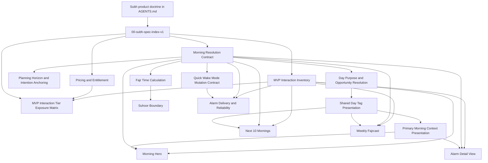

# Subh Specification Index

| Field | Value |
| --- | --- |
| Canonical filename | `00-subh-spec-index-v1.md` |
| Version | 1 |
| Spec status | Canonical Desktop working-spec index |
| Supersedes | Missing source-of-truth reconciliation reference; this index is the replacement |
| Related specs | All active Desktop working specifications |
| Owning domain / surface | Specification navigation, naming, versioning, and source-of-truth reconciliation |
| Implementation audit status | Needs implementation audit |

## Purpose
This index is the entry point for the canonical Subh working specifications in `/Users/omar/Desktop/Subh Working Specification/`.

It replaces references to the missing source-of-truth reconciliation document, records the active spec set, standardizes integer revision naming, and creates the later-audit queue for code/spec drift. The repo-tracked mirror for this working corpus lives in `docs/specs/`. This index is a documentation artifact only; it does not change app behavior, OpenSpec library state, or Swift implementation.

## What This Spec Owns
- Active Desktop working-spec navigation.
- Canonical filename and integer-version conventions.
- The source-of-truth graph and later code/spec audit queue.
- Pricing, entitlement, and tier-overlay navigation across the MVP scenario inventory.

## Normative Requirements
The naming rules, canonical spec list, reading order, and validation expectations below are normative for this Desktop working-spec corpus. The old-name mapping is historical reference data, not an active naming convention.

## MVP Suhoor Alignment Decision
This index records the May 2026 P0/P1 product decision for the MVP spec set.

- The canonical exposed quick wake modes are `Suhoor`, `Fajr`, and `Quiet`.
- `Suhoor` is the only exposed before-Fajr wake mode in MVP.
- `Tahajjud only`, `Other early worship`, and generic `Pre-Fajr` user choices are deferred and must not appear as selectable MVP modes or intentions.
- Legacy prose that says `Fast`, `Pre-Fajr`, `Tahajjud only`, or `Other early worship` is a user-selectable quick mode or before-Fajr intention is superseded by this decision.
- Selecting `Suhoor` means the user intends a before-Fajr wake for suhoor/fasting.
- Suhoor fasting intention defaults to the applicable Sunnah fasting opportunities when they exist; otherwise it defaults to `Voluntary fast`, with supported explicit fasting-purpose overrides available where the detail surface exposes them.
- The Alarm Detail surface uses immediate save/reset behavior for MVP. Older draft-until-Done and staged-reset language is superseded.
- External provider/API/mosque timetable source selection remains future work unless a later implementation plan explicitly promotes it.
- Physical-device alarm QA remains required for AlarmKit permission, audible wake, Focus/silent behavior, reboot, app termination, time-zone changes, wrong-time firing, and missed-delivery reports.

## Out of Scope / Deferred
- Code/spec divergence classification is deferred to a later implementation audit.
- App code, tests, and OpenSpec library artifacts are out of scope for this docs-only cleanup.
- StoreKit implementation, paywalls, feature gates, and Swift behavior changes are out of scope for this docs-only cleanup.
- Renaming `Next 10` to `Next Week` in code is out of scope for this docs-only cleanup.
- Archive filename normalization is out of scope unless a future archive cleanup explicitly requests it.

## Naming and Versioning Rules
- Active spec filenames use lowercase kebab-case and end with `-vN.md`.
- `N` is an integer revision number, not a decimal draft.
- The H1 title does not include the version.
- Version, status, related specs, ownership, and implementation audit state belong in the metadata table.
- Archive filenames remain historical and do not need to be renamed during this cleanup.

## Canonical Spec List
| Spec | Version | Owns | Implementation audit status |
| --- | ---: | --- | --- |
| `subh-morning-resolution-contract-state-ownership-spec-v2.md` | 2 | Core morning resolution graph and state ownership | Needs implementation audit |
| `subh-planning-horizon-day-resolution-intention-anchoring-spec-v2.md` | 2 | Planning horizon, browsable days, and future intention anchoring | Needs implementation audit |
| `subh-quick-wake-mode-intent-mutation-contract-v1.md` | 1 | Shared wake-mode and intention mutation behavior | Needs implementation audit |
| `subh-alarm-delivery-schedule-reliability-spec-v2.md` | 2 | Alarm delivery, scheduling, reconciliation, and diagnostics | Needs implementation audit |
| `subh-fajr-time-calculation-determination-selection-spec-v1.md` | 1 | Prayer-time calculation and method/source selection | Needs implementation audit |
| `subh-early-worship-boundary-spec-v1.md` | 1 | Suhoor before-Fajr boundary model; legacy early-worship terminology is internal/deferred | Needs implementation audit |
| `subh-day-purpose-opportunity-resolution-spec-v1.md` | 1 | Day purpose, observance opportunity, intention, outcome, and credit resolution | Needs implementation audit |
| `subh-shared-day-tag-presentation-contract-v1.md` | 1 | Shared tag/chip presentation across Home, Day Detail, Next 7 Days, Weekly Fajrcast, and future calendar surfaces | Needs implementation audit |
| `subh-primary-morning-context-presentation-spec-v1.md` | 1 | Shared Home and Day Detail day-meaning context presentation | Needs implementation audit |
| `subh-pricing-entitlement-spec-v1.md` | 1 | Tier doctrine, prices, 30-day Complete trial, Ramadan Preview, downgrade/upgrade behavior, paywall rules, and paid-feature data preservation | Needs implementation audit |
| `subh-morning-hero-item-spec-v14.md` | 14 | Home Morning Hero surface | Needs implementation audit |
| `subh-alarm-detail-view-screen-spec-v7.md` | 7 | Selected morning detail editor | Needs implementation audit |
| `subh-next-10-mornings-wake-forecast-spec-v4.md` | 4 | Home Next 10 Mornings forecast surface | Needs implementation audit |
| `subh-weekly-fajrcast-card-spec-v13.md` | 13 | Home Weekly Fajrcast card | Needs implementation audit |
| `subh-mvp-interaction-inventory-v3.md` | 3 | MVP scenario coverage and traceability | Needs implementation audit |
| `subh-mvp-interaction-tier-exposure-matrix-v1.md` | 1 | Entitlement exposure overlay for MVP scenarios S001-S235 and pricing-specific P scenarios | Needs implementation audit |

## Supporting Integration Notes
| Document | Version | Owns | Implementation audit status |
| --- | ---: | --- | --- |
| `subh-context-tags-integration-addendum-v1.md` | 1 | Surgical cross-spec integration notes for Primary Morning Context and Shared Day Tags | Needs implementation audit |
| `subh-context-spec-integrity-review-v1.md` | 1 | Integrity review explaining the context/tag split, conflict resolution, and implementation order | Needs implementation audit |

## Primary Morning Context / Shared Tag Alignment Decision

The active MVP spec set now treats day context presentation as a shared presentation layer rather than a separate resolver.

Rules:
1. `ResolvedDayPurpose` remains the source for opportunity, intention, required action, and credit separation.
2. Shared tag presentation consumes resolved opportunity/intention outputs and does not create analytics truth.
3. The Primary Morning Context module consumes the same resolved payload on Home and Day Detail.
4. The Hero owns wake execution copy. The Primary Morning Context owns day meaning and selected-purpose explanation.
5. Alarm Detail must not maintain a separate opportunity/context-copy engine.

## Scenario, Entitlement, and Pricing Authority
- `subh-mvp-interaction-inventory-v3.md` remains the scenario authority for `S001-S235`. It owns scenario identity, scenario grouping, and MVP traceability.
- `subh-mvp-interaction-tier-exposure-matrix-v1.md` is the entitlement overlay for those scenarios. It may classify whether a scenario is available, locked, previewed, read-only, or schedule-eligible by tier, but it does not replace or renumber `S001-S235`.
- `subh-pricing-entitlement-spec-v1.md` owns tier doctrine, prices, trial behavior, Ramadan Preview behavior, downgrade/upgrade behavior, paywall rules, entitlement resolution, and paid-feature data preservation.
- Pricing and tier exposure must not create a parallel morning engine. They gate surfaces, horizons, mutations, logs, and scheduling eligibility while preserving the canonical morning-resolution graph.
- The active MVP exposed modes remain `Suhoor | Fajr | Quiet`. `Tahajjud only`, `Other early worship`, and generic `Pre-Fajr` are not active MVP choices; legacy values may remain compatibility aliases only.

## Old-Name Mapping
This table is intentionally the only active place where old active filenames should appear.

| Previous active filename | Canonical filename |
| --- | --- |
| `alarm_detailed_view_screen_spec_v7.md` | `subh-alarm-detail-view-screen-spec-v7.md` |
| `early-worship-boundary-spec.md` | `subh-early-worship-boundary-spec-v1.md` |
| `Fajr_Time_Calculation_Determination_Selection_Spec_v1.md` | `subh-fajr-time-calculation-determination-selection-spec-v1.md` |
| `Morning_Hero_Item_Specification_v14.md` | `subh-morning-hero-item-spec-v14.md` |
| `Next_10_Mornings_Wake_Forecast_Specification_v4.md` | `subh-next-10-mornings-wake-forecast-spec-v4.md` |
| `Subh_Alarm_Delivery_and_Schedule_Reliability_Spec_v2.md` | `subh-alarm-delivery-schedule-reliability-spec-v2.md` |
| `Subh_Morning_Resolution_Contract_and_State_Ownership_Spec_v2.md` | `subh-morning-resolution-contract-state-ownership-spec-v2.md` |
| `Subh_Planning_Horizon_Day_Resolution_and_Intention_Anchoring_Spec_v2.md` | `subh-planning-horizon-day-resolution-intention-anchoring-spec-v2.md` |
| `Subh_Quick_Wake_Mode_and_Intent_Mutation_Contract_v1.md` | `subh-quick-wake-mode-intent-mutation-contract-v1.md` |
| `subh-day-purpose-opportunity-resolution-spec.md` | `subh-day-purpose-opportunity-resolution-spec-v1.md` |
| `subh_mvp_interaction_inventory_v3.md` | `subh-mvp-interaction-inventory-v3.md` |
| `Weekly_Fajrcast_Card_Specification_v13.md` | `subh-weekly-fajrcast-card-spec-v13.md` |

## Source-of-Truth Graph

## Reading Order
1. Start with `subh-morning-resolution-contract-state-ownership-spec-v2.md`.
2. Read `subh-planning-horizon-day-resolution-intention-anchoring-spec-v2.md` and `subh-day-purpose-opportunity-resolution-spec-v1.md` for date meaning, future edits, and intention ownership.
3. Read `subh-shared-day-tag-presentation-contract-v1.md` and `subh-primary-morning-context-presentation-spec-v1.md` before implementing Home, Alarm Detail, Next 7 Days, or Weekly Fajrcast context/tag presentation.
4. Read `subh-context-tags-integration-addendum-v1.md` for surgical cross-spec patch direction when updating existing surfaces.
5. Read `subh-fajr-time-calculation-determination-selection-spec-v1.md` and `subh-early-worship-boundary-spec-v1.md` for prayer-window and Suhoor before-Fajr boundary assumptions.
6. Read `subh-quick-wake-mode-intent-mutation-contract-v1.md` before implementing Home or detail wake-mode edits.
7. Read `subh-alarm-delivery-schedule-reliability-spec-v2.md` before making scheduling, permission, fallback, or diagnostics claims.
8. Read surface specs after the contracts they consume: Morning Hero, Alarm Detail, Next 10 Mornings, and Weekly Fajrcast.
9. Use `subh-mvp-interaction-inventory-v3.md` as the scenario traceability backbone for `S001-S235`.
10. Read `subh-pricing-entitlement-spec-v1.md` for tier doctrine, prices, trial, downgrade/upgrade, paywall, entitlement, and data-preservation rules.
11. Read `subh-mvp-interaction-tier-exposure-matrix-v1.md` after the inventory and pricing spec when mapping `S001-S235` to Free, Plus, Complete, Complete Lifetime, Trial Complete, and Ramadan Preview exposure.

## Later Code/Spec Audit Queue
The cleanup pass deliberately does not classify app conformance. A later audit should:
- Map each canonical spec to Swift modules, tests, and OpenSpec artifacts.
- Classify MVP inventory scenarios as Implemented, Partially Implemented, Missing, Risky, or Not Testable Yet.
- Identify claims in the prose specs that describe future targets but are already implemented, partially implemented, or no longer accurate.
- Separate specification gaps from implementation gaps.
- Produce a prioritized gap matrix covering resolution precedence, quick wake mutations, alarm delivery reliability, Fajr calculation assumptions, early worship boundaries, day purpose, Home hero, Alarm Detail, Next 10, Weekly Fajrcast, accessibility, privacy, and degraded states.
- Add entitlement implementation mapping only after a dedicated implementation pass; this docs pass does not implement StoreKit, paywalls, feature gates, or entitlement-dependent scheduling behavior.
- Update implementation audit status fields only after that audit has evidence.

## Validation Expectations
- Every active spec filename should match `^[a-z0-9]+(-[a-z0-9]+)*-v[0-9]+\.md$`.
- Stale active filename references should not appear outside this index's old-name mapping.
- Decimal revision strings should not be used as canonical spec versions.
- Pricing and tier specs must preserve the MVP Suhoor decision: exposed modes are `Suhoor | Fajr | Quiet`; `Tahajjud only`, `Other early worship`, and generic `Pre-Fajr` are not active MVP choices.
- `Archive/` remains historical and is excluded from active spec naming normalization.
