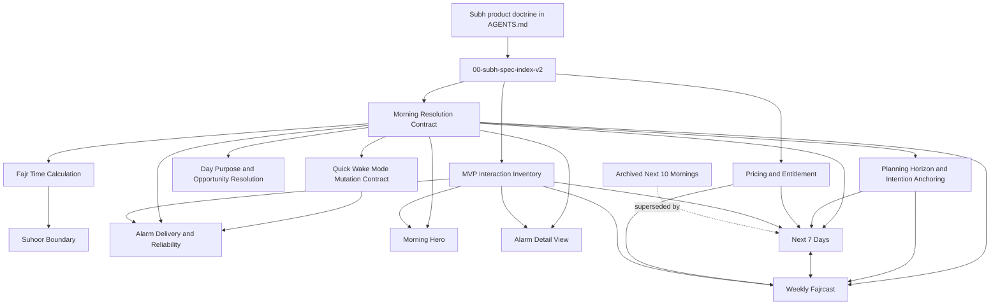

# Subh Specification Index

| Field | Value |
| --- | --- |
| Canonical filename | `00-subh-spec-index-v2.md` |
| Version | 2 |
| Spec status | Canonical Desktop working-spec index; aligned to Next 7 Days / Weekly Fajrcast horizon decision |
| Supersedes | `00-subh-spec-index-v1.md` |
| Related specs | All active Desktop working specifications |
| Owning domain / surface | Specification navigation, naming, versioning, and source-of-truth reconciliation |
| Implementation audit status | Needs implementation audit |

## Purpose
This index is the entry point for the canonical Subh working specifications in `/Users/omar/Desktop/Subh Working Specification/`.

It records the active spec set, standardizes integer revision naming, captures the current MVP source-of-truth decisions, and creates the later-audit queue for code/spec drift. It is a documentation artifact only; it does not change app behavior, OpenSpec library state, or Swift implementation.

## What This Spec Owns
- Active Desktop working-spec navigation.
- Canonical filename and integer-version conventions.
- The source-of-truth graph and later code/spec audit queue.
- The archival status of the old `Next 10 Mornings` forecast spec.

## Normative Requirements
The naming rules, canonical spec list, reading order, and validation expectations below are normative for this Desktop working-spec corpus. The old-name mapping is historical reference data, not an active naming convention.

## MVP Suhoor Alignment Decision
This index records the May 2026 P0/P1 product decision for the MVP spec set.

- The canonical exposed quick wake modes are `Suhoor`, `Fajr`, and `Quiet`.
- `Suhoor` is the only exposed before-Fajr wake mode in MVP.
- `Tahajjud only`, `Other early worship`, and generic `Pre-Fajr` user choices are deferred and must not appear as selectable MVP modes or intentions.
- Legacy prose that says `Fast`, `Pre-Fajr`, `Tahajjud only`, or `Other early worship` is a user-selectable quick mode or before-Fajr intention is superseded by this decision.
- Selecting `Suhoor` means the user intends a before-Fajr wake for suhoor/fasting.
- Suhoor fasting intention defaults to the applicable Sunnah fasting opportunities when they exist; otherwise it defaults to `Voluntary fast`, with supported explicit fasting-purpose overrides available where the detail surface exposes them.
- The Alarm Detail surface uses immediate save/reset behavior for MVP. Older draft-until-Done and staged-reset language is superseded.
- External provider/API/mosque timetable source selection remains future work unless a later implementation plan explicitly promotes it.
- Physical-device alarm QA remains required for AlarmKit permission, audible wake, Focus/silent behavior, reboot, app termination, time-zone changes, wrong-time firing, and missed-delivery reports.

## Next 7 Days / Weekly Fajrcast Alignment Decision
This index records the May 2026 product decision to remove the old ten-morning Home forecast horizon and align the Home forecast with the Weekly Fajrcast card.

The active MVP Home forecast surface is now:

```text
Next 7 Days
```

The archived surface is:

```text
Next 10 Mornings
```

Rules:

1. The active Home forecast spec is `subh-next-7-days-wake-forecast-spec-v1.md`.
2. The old `subh-next-10-mornings-wake-forecast-spec-v4.md` is archived and must not be treated as an active behavior source.
3. `Next 7 Days` shows exactly seven resolved Fajr-centered days when expanded and ready.
4. The first visible day is the next immediate alarm or next relevant morning supplied by the canonical resolver.
5. The remaining six visible days are the six following calendar mornings.
6. Weekly Fajrcast v14 uses the exact same seven visible date keys, in the same order, as `Next 7 Days`.
7. Weekly Fajrcast no longer uses a centered previous-three / next-three window for MVP.
8. Scrubbing or inspecting Weekly Fajrcast is temporary UI focus movement inside the same seven-day window; it does not scroll the chart to past days or load an eighth day.
9. `Next 7 Days`, Weekly Fajrcast, month browsing, and Day Detail remain display/edit surfaces only. Their visible days are not platform-scheduled merely because they are visible.
10. Delivery still consumes only resolver-materialized events inside the active scheduled horizon.

## Out of Scope / Deferred
- Code/spec divergence classification is deferred to a later implementation audit.
- App code, tests, and OpenSpec library artifacts are out of scope for this docs-only cleanup.
- Archive filename normalization is out of scope unless a future archive cleanup explicitly requests it.
- Full Home screen composition remains a future dedicated spec unless promoted by a later product decision.

## Naming and Versioning Rules
- Active spec filenames use lowercase kebab-case and end with `-vN.md`.
- `N` is an integer revision number, not a decimal draft.
- The H1 title does not include the version.
- Version, status, related specs, ownership, and implementation audit state belong in the metadata table.
- Archive filenames remain historical and do not need to be renamed during this cleanup.
- Archived specs must remain in `Archive/` or be clearly marked as archived if moved elsewhere.

## Canonical Spec List
| Spec | Version | Owns | Implementation audit status |
| --- | ---: | --- | --- |
| `subh-pricing-entitlement-spec-v2.md` | 2 | Pricing, entitlement, trial access, paywall rules, downgrade/upgrade behavior, paid-feature data preservation | Needs implementation audit |
| `subh-morning-resolution-contract-state-ownership-spec-v3.md` | 3 | Core morning resolution graph and state ownership | Needs implementation audit |
| `subh-planning-horizon-day-resolution-intention-anchoring-spec-v3.md` | 3 | Planning horizon, browsable days, and future intention anchoring | Needs implementation audit |
| `subh-quick-wake-mode-intent-mutation-contract-v2.md` | 2 | Shared wake-mode and intention mutation behavior | Needs implementation audit |
| `subh-alarm-delivery-schedule-reliability-spec-v3.md` | 3 | Alarm delivery, scheduling, reconciliation, and diagnostics | Needs implementation audit |
| `subh-fajr-time-calculation-determination-selection-spec-v1.md` | 1 | Prayer-time calculation and method/source selection | Needs implementation audit |
| `subh-early-worship-boundary-spec-v2.md` | 2 | Suhoor before-Fajr boundary model; legacy early-worship terminology is internal/deferred | Needs implementation audit |
| `subh-day-purpose-opportunity-resolution-spec-v1.md` | 1 | Day purpose, observance opportunity, intention, outcome, and credit resolution | Needs implementation audit |
| `subh-morning-hero-item-spec-v15.md` | 15 | Home Morning Hero surface | Needs implementation audit |
| `subh-alarm-detail-view-screen-spec-v7.md` | 7 | Selected morning detail editor | Needs implementation audit |
| `subh-next-7-days-wake-forecast-spec-v1.md` | 1 | Home Next 7 Days forecast surface | Needs implementation audit |
| `subh-weekly-fajrcast-card-spec-v14.md` | 14 | Home Weekly Fajrcast card | Needs implementation audit |
| `subh-mvp-interaction-inventory-v4.md` | 4 | MVP scenario coverage and traceability | Needs implementation audit |

## Archived Specs
| Archived spec | Prior role | Replacement / current status |
| --- | --- | --- |
| `Archive/subh-next-10-mornings-wake-forecast-spec-v4.md` | Home Next 10 Mornings forecast surface | Replaced by `subh-next-7-days-wake-forecast-spec-v1.md`. Kept only for historical traceability. |

## Old-Name Mapping
This table is intentionally the only active place where old active filenames should appear.

| Previous active filename | Canonical filename |
| --- | --- |
| `00-subh-spec-index-v1.md` | `00-subh-spec-index-v2.md` |
| `subh-pricing-entitlement-spec-v1.md` | `subh-pricing-entitlement-spec-v2.md` |
| `alarm_detailed_view_screen_spec_v7.md` | `subh-alarm-detail-view-screen-spec-v7.md` |
| `early-worship-boundary-spec.md` | `subh-early-worship-boundary-spec-v2.md` |
| `subh-early-worship-boundary-spec-v1.md` | `subh-early-worship-boundary-spec-v2.md` |
| `Fajr_Time_Calculation_Determination_Selection_Spec_v1.md` | `subh-fajr-time-calculation-determination-selection-spec-v1.md` |
| `Morning_Hero_Item_Specification_v14.md` | `subh-morning-hero-item-spec-v15.md` |
| `subh-morning-hero-item-spec-v14.md` | `subh-morning-hero-item-spec-v15.md` |
| `Next_10_Mornings_Wake_Forecast_Specification_v4.md` | `Archive/subh-next-10-mornings-wake-forecast-spec-v4.md` |
| `subh-next-10-mornings-wake-forecast-spec-v4.md` | `Archive/subh-next-10-mornings-wake-forecast-spec-v4.md` |
| `Subh_Alarm_Delivery_and_Schedule_Reliability_Spec_v2.md` | `subh-alarm-delivery-schedule-reliability-spec-v3.md` |
| `subh-alarm-delivery-schedule-reliability-spec-v2.md` | `subh-alarm-delivery-schedule-reliability-spec-v3.md` |
| `Subh_Morning_Resolution_Contract_and_State_Ownership_Spec_v2.md` | `subh-morning-resolution-contract-state-ownership-spec-v3.md` |
| `subh-morning-resolution-contract-state-ownership-spec-v2.md` | `subh-morning-resolution-contract-state-ownership-spec-v3.md` |
| `Subh_Planning_Horizon_Day_Resolution_and_Intention_Anchoring_Spec_v2.md` | `subh-planning-horizon-day-resolution-intention-anchoring-spec-v3.md` |
| `subh-planning-horizon-day-resolution-intention-anchoring-spec-v2.md` | `subh-planning-horizon-day-resolution-intention-anchoring-spec-v3.md` |
| `Subh_Quick_Wake_Mode_and_Intent_Mutation_Contract_v1.md` | `subh-quick-wake-mode-intent-mutation-contract-v2.md` |
| `subh-quick-wake-mode-intent-mutation-contract-v1.md` | `subh-quick-wake-mode-intent-mutation-contract-v2.md` |
| `subh-day-purpose-opportunity-resolution-spec.md` | `subh-day-purpose-opportunity-resolution-spec-v1.md` |
| `subh_mvp_interaction_inventory_v3.md` | `subh-mvp-interaction-inventory-v4.md` |
| `subh-mvp-interaction-inventory-v3.md` | `subh-mvp-interaction-inventory-v4.md` |
| `Weekly_Fajrcast_Card_Specification_v13.md` | `subh-weekly-fajrcast-card-spec-v14.md` |
| `subh-weekly-fajrcast-card-spec-v13.md` | `subh-weekly-fajrcast-card-spec-v14.md` |

## Source-of-Truth Graph


## Reading Order
1. Start with `subh-morning-resolution-contract-state-ownership-spec-v3.md`.
2. Read `subh-planning-horizon-day-resolution-intention-anchoring-spec-v3.md` and `subh-day-purpose-opportunity-resolution-spec-v1.md` for date meaning, future edits, and intention ownership.
3. Read `subh-fajr-time-calculation-determination-selection-spec-v1.md` and `subh-early-worship-boundary-spec-v2.md` for prayer-window and Suhoor before-Fajr boundary assumptions.
4. Read `subh-quick-wake-mode-intent-mutation-contract-v2.md` before implementing Home or detail wake-mode edits.
5. Read `subh-alarm-delivery-schedule-reliability-spec-v3.md` before making scheduling, permission, fallback, or diagnostics claims.
6. Read surface specs after the contracts they consume: `subh-morning-hero-item-spec-v15.md`, `subh-alarm-detail-view-screen-spec-v7.md`, `subh-next-7-days-wake-forecast-spec-v1.md`, and `subh-weekly-fajrcast-card-spec-v14.md`.
7. Read `subh-pricing-entitlement-spec-v2.md` when implementing paywalls, trials, feature gating, or horizon-based entitlement behavior.
8. Use `subh-mvp-interaction-inventory-v4.md` as the scenario traceability backbone.

## Later Code/Spec Audit Queue
The cleanup pass deliberately does not classify app conformance. A later audit should:

- Map each canonical spec to Swift modules, tests, and OpenSpec artifacts.
- Classify MVP inventory scenarios as Implemented, Partially Implemented, Missing, Risky, or Not Testable Yet.
- Identify claims in the prose specs that describe future targets but are already implemented, partially implemented, or no longer accurate.
- Separate specification gaps from implementation gaps.
- Produce a prioritized gap matrix covering resolution precedence, quick wake mutations, alarm delivery reliability, Fajr calculation assumptions, early worship boundaries, day purpose, Home hero, Alarm Detail, Next 7 Days, Weekly Fajrcast, accessibility, privacy, and degraded states.
- Verify that the code no longer hard-codes ten forecast rows, `NextTen` type names, or centered weekly previous/next chart assumptions where the active specs now require a seven-day aligned horizon.
- Update implementation audit status fields only after that audit has evidence.

## Validation Expectations
- Every active spec filename should match `^[a-z0-9]+(-[a-z0-9]+)*-v[0-9]+\.md$`, except this index file, which intentionally begins with `00-`.
- Stale active filename references should not appear outside this index's old-name mapping, archived-spec table, supersedes fields, or explicit archival notes.
- `Next 10 Mornings` must not appear as active behavior in any active spec.
- `Next 10 Mornings` may appear only as an archived historical reference.
- Weekly Fajrcast must not use the old centered previous-three / next-three window as active MVP behavior.
- Decimal revision strings should not be used as canonical spec versions.
- `Archive/` remains historical and is excluded from active spec naming normalization.
